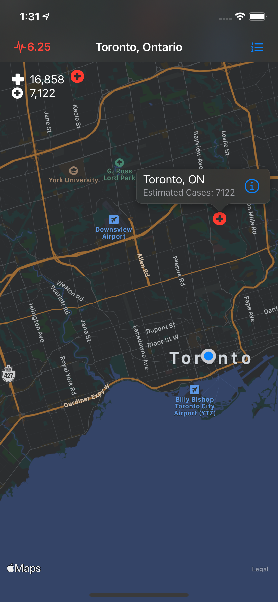
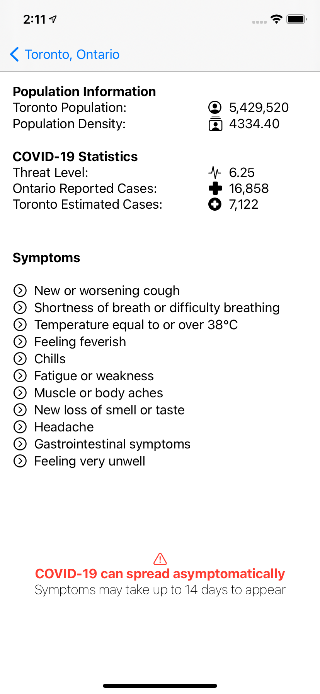
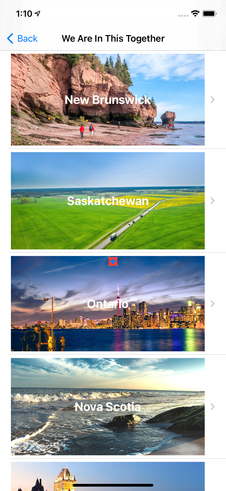
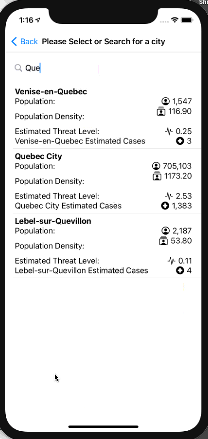
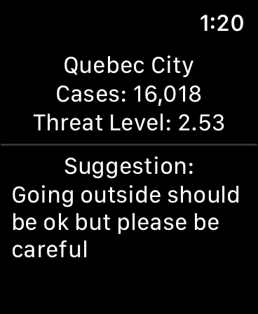
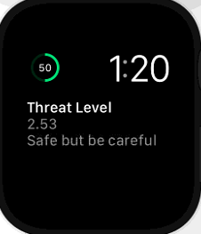

# COVID-19_Hotspot-Map

**App Name:** COVID-19 Hotspot Map  
**Group #2:** Zachary (991 349 781), Yuan (991 470 659)

**Date:** November 30, 2020

**Work Distribution:** 
Zachary:
- CoreData
- Location Services
- API Access
- MapView
- Detail view

Yuan:
- Watch OS Connectivity/Content View/Complication
- UserDefault
- ProvinceCitiesView
- ProvincesView
- Navigation to currentLocation from ProvinceCitiesView
- Localization

**Purpose:** 
The purpose of this app is to display a heatmap of COVID-19 cases across Canada and inform the user whether they’re in a probable hotspot or not (since information on cases are not posted by city we have to make predictions based on population size and density).

**Target Audience:** 
Everyone, especially at-risk individuals who would benefit from the access to this valuable information.

**Main Features:**
- View estimated number of active COVID-19 cases per city
-	See a heat map of active Canadian COVID-19 cases
-	View a list of the cities from different provinces (includes their associated risk scores and data)
-	View a risk score for your location
- Display crucial information and suggestion through Watch OS 

**iOS Services and Functionality:**
-	CoreData
- UserDefault
-	Location Services
-	Watch OS
-	Views
-	NavigationView
-	MapView
-	API Access
- List
- Z Stack / V Stack / H Stack
- Gesture
- Image

**Entities:**
-	Locality
-	Province
-	ProvincialSummary

**ViewModels:**
-	CovidViewModel

**Views:**
-	MapView
-	ProvincialSummaryView
-	ProvincesView
- ProvinceCitiesView
- SearchBar
- ContentView
- ContentView (Watch OS)
- Complication display (Watch OS)

**Use-Cases** 
View Cities:
1.	The user can view a sorted list of cities within each province, and navigate to the map location on tap gesture

View Heatmap:
1.	The first view the user is presented with is the heatmap; this view shows the user’s current location on a heatmap of COVID-19 cases by locality

View Details:
1.	The user can view their details, such as their COVID-19 risk-score; this score is based on the population density and the predicted cases for the areas the user has been; it takes into account the user’s history within the past 14 days

View On Watch OS:
1.  The user can view the updated information / suggestion based on their current location on watch OS and its complication

**Screenshots:**

