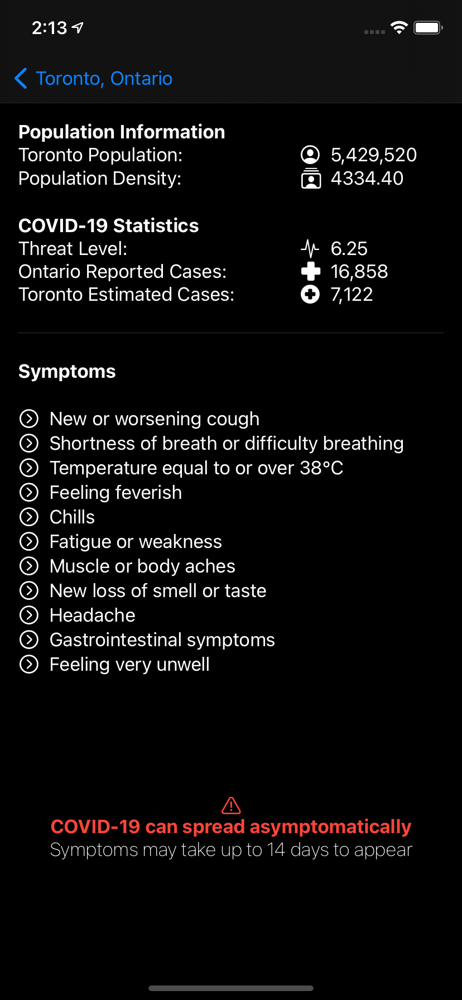

# COVID-19_Hotspot-Map

**App Name:** COVID-19 Hotspot Map  
**Group #2:** Zachary (991 349 781), Yaun (991 470 659)

**Date:** November 30, 2020

**Work Distribution:** 
Zachary:
- CoreData
- Location Services
- API Access
- MapView
- Detail view

Yuan:
- Data visualization (heatmap/data overlays on map)
- Province Selection View
- Province Cities View
- WatchOS
- Notification View debug

**Purpose:** 
The purpose of this app is to display a heatmap of COVID-19 cases across Canada and inform the user whether they’re in a probable hotspot or not (since information on cases are not posted by city we have to make predictions based on population size and density).

**Target Audience:** 
Everyone, especially at-risk individuals who would benefit from the access to this valuable information.

**Main Features:**
- View estimated number of active COVID-19 cases per city
-	See a heat map of active Canadian COVID-19 cases
-	View a cities within the pronvince includes their associated risk scores, and search for your city
-	View a risk score for your location

**iOS Services and Functionality:**
- List
- Gesture
-	CoreData
- VStack, HStack and ZStack
-	WatchOS
-	Location Services
-	Views
-	NavigationView
-	MapView
-	API Access

**Entities:**
-	Locality
-	Province
-	ProvincialSummary

**ViewModels:**
-	CovidViewModel

**Views:**
-	MapView
-	ProvincialSummaryView
- PronvinceSelectionView
-	ProvinceCitiesView

**Use-Cases** 
View Cities:
1.	The user can view a sorted list of cities grouped by province, and search for their cities on the search bar
2.  When tapped on the selected city, it will navigate back to the home screen, with the updated location

View Heatmap:
1.	The first view the user is presented with is the heatmap; this view shows the user’s current location on a heatmap of COVID-19 cases by locality
2.	As the user goes about their day location data is recorded; this historic data is plotted on the heatmap so the user can see where they’ve been and if they’ve entered a COVID-19 hotspot

View Details:
1.	The user can view their details, such as their COVID-19 risk-score; this score is based on the population density and the predicted cases for the areas the user has been; it takes into account the user’s history within the past 14 days

**Screenshots:**

